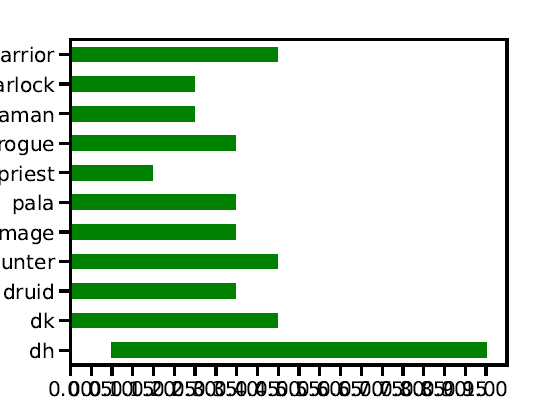

# metagame: Fork to work with d0nkey with limited copy pasting from it

## Example output (can use updating with fonts etc I know)

### Interpretation of the output:
"Based on those win rates you input per class, the class will be played and be competitive between these factors of played (the image goes from 0% played to 50% on the X axis). E.g. in the above example DH will be competitive to play even if it's played by [up to] 50% of players (the practical explanation is "because it usually wins unless it's purely mirrored").

## Fork's notes:
1) Initially based on the presentation at https://www.youtube.com/watch?v=miu3ldl-nY4
2) See the _process text file for details on how to install and run
3) Mainly you copy paste data from d0nkey's "VS Class" X 11

## metagame notes from the initial repo from 9 years ago
Compute metagame bounds from matchup charts.

No command-line interface as of yet - easiest thing is to just copy paste! There's very little code. You WILL however need to install pandas, matplotlib, pulp, and seaborn to use the code. 
